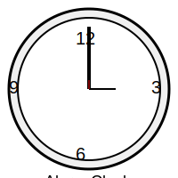

# alarm-clock-C


---

# Alarm Clock Project

## Overview

This project is a simple alarm clock program written in C. It allows users to set, cancel, and monitor alarms based on a 12-hour format with AM/PM notation. The program provides a text-based menu interface for interacting with the alarm system and an ongoing loop to check and activate alarms as needed.

## Features

- **Set Alarms**: Configure alarms with a specific hour, minute, second, and AM/PM period.
- **Cancel Alarms**: Remove alarms from the active list.
- **View Alarms**: Display all currently set alarms.
- **Monitor Alarms**: Continuously check and trigger alarms at their scheduled times.
- **User Interface**: Simple menu-driven interface for ease of use.

## Prerequisites

- A C compiler (e.g., GCC)
- Basic understanding of how to compile and run C programs

## Installation

1. **Clone the Repository**: Download the source code from the repository.

    ```bash
    git clone https://github.com/mdriyadkhan585/alarm-clock-C
    cd alarm-clock-C 
    ```

2. **Compile the Program**: Use a C compiler to compile the source code. For GCC, you can use:

    ```bash
    gcc -o alarm_clock alarm_clock.c
    ```

3. **Run the Program**: Execute the compiled program:

    ```bash
    ./alarm_clock
    ```

## Usage

### Main Menu

Upon running the program, you will be presented with the main menu. Here are the available options:

1. **Set Alarm**: Configure a new alarm.

    - **Hour (1-12)**: Enter the hour in 12-hour format.
    - **Minute (0-59)**: Enter the minute.
    - **Second (0-59)**: Enter the second.
    - **AM/PM (A/P)**: Specify AM or PM.

    Example:
    
    ```
    Enter alarm time (12-hour format):
    Hour (1-12): 7
    Minute (30): 15
    Second (0): 0
    AM/PM (A/P): A
    ```

2. **Cancel Alarm**: Remove an existing alarm.

    - View the list of active alarms.
    - Enter the number of the alarm you wish to cancel.

    Example:
    
    ```
    Enter the number of the alarm to cancel: 1
    ```

3. **Show Alarms**: Display all currently set alarms.

    - A list of all active alarms will be shown with their respective times.

4. **Done**: Finalize alarm setup and start the monitoring process.

    - When you choose "Done", the program will exit the menu and start monitoring for active alarms.

### Program Operation

- **Alarm Monitoring**: After choosing "Done", the program enters an ongoing loop where it continuously checks the current time against the set alarms.
- **Alarm Activation**: When the system time matches the time of an active alarm, the alarm will trigger, and a message will be displayed.
- **Alarm Deactivation**: Once triggered, the alarm will be deactivated automatically to prevent multiple triggers.

### Example Interaction

```
Current time: 12:34:56

Options:
1. Set Alarm
2. Cancel Alarm
3. Show Alarms
4. Done
Choose an option: 1

Enter alarm time (12-hour format):
Hour (1-12): 6
Minute (30): 0
Second (0): 0
AM/PM (A/P): P

Alarm set for 06:30:00 PM

Options:
1. Set Alarm
2. Cancel Alarm
3. Show Alarms
4. Done
Choose an option: 4

Starting alarm...
```

## Troubleshooting

- **Invalid Input**: If you enter invalid data (e.g., an hour outside 1-12), the program will prompt you to enter valid values.
- **Program Not Starting**: Ensure you have compiled the program correctly and have the necessary permissions to execute it.

## Contributing

Feel free to contribute to this project by submitting issues or pull requests. To contribute:

1. Fork the repository.
2. Create a new branch for your changes.
3. Make your modifications and commit them.
4. Submit a pull request for review.

---
